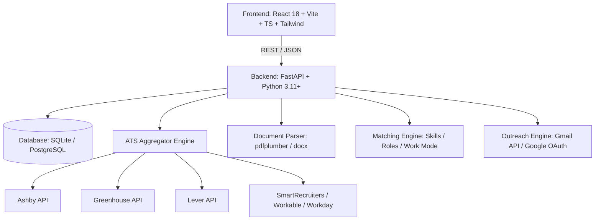

# AI Job Hunter

> An intelligent, production-quality job search & outreach platform that aggregates open roles directly from public Applicant Tracking Systems (ATS) with zero unauthorized scraping, matches them against your resume, and automates tailored outreach via Gmail.

---

## Highlights

- **Zero Unauthorized Scraping**: Connects directly to official, public ATS job boards and APIs including **Greenhouse**, **Lever**, **Ashby**, **SmartRecruiters**, **Workable**, and **Workday**.
- **Resume Parsing & Skill Extraction**: Upload PDF or DOCX resumes to extract skills, experience levels, target roles, and personalized search queries.
- **Intelligent Candidate Matching Engine**: Computes candidate-to-job match scores (0–100%) and categorizes listings into High, Medium, and Low tiers with matched skill badges and gap analysis.
- **AI-Tailored Cold Pitch Email Generation**: Crafts professional, personalized job outreach pitches referencing specific candidate strengths and role requirements (supports Google Gemini, OpenAI, or built-in deterministic rule-based NLP).
- **1-Click Gmail Outreach**: Sends cold emails or saves drafts directly in your connected Gmail inbox with your resume attached (supports Google OAuth 2.0 and simulated test inbox).
- **Formatted Excel Export**: Exports visible and filtered jobs to `.xlsx` spreadsheets with color-coded match indicators, recruiter contacts, and direct application links.
- **High-Density Linear-Style UI**: Fast, keyboard-friendly, dark/light theme, dense data tables, responsive layouts, and zero generic marketing clutter.

---

## Architecture & Tech Stack



### Frontend
- **Framework**: React 18 with TypeScript
- **Tooling**: Vite
- **Styling**: Tailwind CSS (custom dark/light tokens, high-density spreadsheet layout)
- **Icons**: Lucide React
- **HTTP Client**: Axios

### Backend
- **Framework**: FastAPI (Python 3.11+)
- **ORM & Migrations**: SQLAlchemy 2.0, Alembic
- **Validation**: Pydantic v2 / Pydantic Settings
- **Security**: JWT Authentication (python-jose, bcrypt / passlib)
- **Excel Generation**: OpenPyXL
- **Document Processing**: `pdfplumber`, `python-docx`
- **AI Providers**: Google Gemini API (`google-generativeai`), OpenAI (optional), Deterministic Rule-Based Fallback
- **Integrations**: Google OAuth 2.0 & Gmail API Client

---

## Directory Structure

```text
ai-job-hunter/
├── backend/
│   ├── alembic/                      # Database migrations
│   ├── app/
│   │   ├── api/v1/                   # REST API routes
│   │   │   ├── endpoints/            # auth, profiles, resumes, jobs, export, gmail, applications
│   │   │   └── router.py             # Main v1 API router
│   │   ├── core/                     # Config, database engine, JWT security
│   │   ├── integrations/             # ATS connectors (Greenhouse, Lever, Ashby, etc.) & Gmail
│   │   ├── models/                   # SQLAlchemy models (User, Job, Company, Profile, Resume, etc.)
│   │   ├── repositories/             # Database access layers
│   │   ├── schemas/                  # Pydantic request/response schemas
│   │   ├── services/                 # Matching engine, AI generator, Excel exporter
│   │   └── main.py                   # FastAPI app entry point & CORS configuration
│   ├── requirements.txt              # Python dependencies
│   └── .env.example                  # Backend environment template
├── frontend/
│   ├── src/
│   │   ├── components/               # UI Components (JobTable, Navbar, AuthModal, EmailModal, etc.)
│   │   ├── services/                 # Axios API client & endpoints
│   │   ├── types/                    # TypeScript interfaces & definitions
│   │   ├── App.tsx                   # Main application layout & state
│   │   └── index.css                 # Global styling and design system tokens
│   ├── package.json                  # Frontend dependencies & scripts
│   └── vite.config.ts                # Vite configuration
├── docker-compose.yml                # Multi-container orchestration (Backend + Frontend + PostgreSQL)
├── DEPLOYMENT.md                     # Comprehensive deployment guide
└── render.yaml                       # Render blueprint specification
```

---

## Getting Started

### Prerequisites
- Python 3.11+
- Node.js 18+ and npm
- (Optional) Docker and Docker Compose

---

### Local Setup (Without Docker)

#### 1. Backend Setup

```bash
cd backend

# Create and activate virtual environment
python -m venv .venv

# Windows:
.\.venv\Scripts\activate
# macOS/Linux:
# source .venv/bin/activate

# Install dependencies
pip install -r requirements.txt

# Run migrations (or let FastAPI auto-generate SQLite tables on startup)
alembic upgrade head

# Start FastAPI development server
uvicorn app.main:app --reload --port 8000
```

- API Documentation (Swagger UI): [http://localhost:8000/docs](http://localhost:8000/docs)
- Alternative Docs (ReDoc): [http://localhost:8000/redoc](http://localhost:8000/redoc)
- Health Check: [http://localhost:8000/health](http://localhost:8000/health)

#### 2. Frontend Setup

```bash
cd frontend

# Install dependencies
npm install

# Start Vite development server
npm run dev
```

- App Web UI: [http://localhost:5173](http://localhost:5173)

---

### Docker Compose Setup

Run the entire stack with a single command:

```bash
docker compose up -d --build
```

- Frontend: [http://localhost:5173](http://localhost:5173)
- Backend API & Swagger: [http://localhost:8000/docs](http://localhost:8000/docs)
- PostgreSQL Database: `localhost:5432`

---

## Configuration & Environment Variables

### Backend Configuration (`backend/.env`)

| Variable | Description | Default / Example |
| :--- | :--- | :--- |
| `PROJECT_NAME` | Name of the project | `AI Job Hunter` |
| `DATABASE_URL` | PostgreSQL connection string (falls back to SQLite if empty) | `sqlite:///./ai_job_hunter.db` |
| `SUPABASE_POSTGRES_URL` | Optional Supabase connection string | `postgresql://...` |
| `SECRET_KEY` | Secret key for JWT signing | *Secure random string* |
| `ALGORITHM` | JWT signing algorithm | `HS256` |
| `ACCESS_TOKEN_EXPIRE_MINUTES` | Access token lifespan | `10080` (7 days) |
| `BACKEND_CORS_ORIGINS` | JSON list of allowed origins | `["http://localhost:5173", "http://localhost:3000"]` |
| `GOOGLE_CLIENT_ID` | Google OAuth Client ID for Gmail | `11438996360-...` |
| `GOOGLE_CLIENT_SECRET` | Google OAuth Client Secret | `GOCSPX-...` |
| `GOOGLE_REDIRECT_URI` | Google OAuth Redirect URI | `http://localhost:5173/auth/gmail/callback` |
| `GEMINI_API_KEY` | Optional Google Gemini API key for outreach generation | `AIzaSy...` |
| `GEMINI_MODEL` | Gemini model variant | `gemini-3.1-flash-lite` |
| `OPENAI_API_KEY` | Optional OpenAI API key (if using OpenAI instead of Gemini) | `sk-...` |

### Frontend Configuration (`frontend/.env`)

| Variable | Description | Default |
| :--- | :--- | :--- |
| `VITE_API_URL` | Backend API base URL | `http://localhost:8000/api/v1` |

---

## Gmail Integration & Testing

### Option A: Real Google Account (OAuth 2.0)
1. Go to [Google Cloud Console: OAuth consent screen](https://console.cloud.google.com/apis/credentials/consent).
2. While the app is in **Testing** publishing status, scroll to **Test users** and click **+ ADD USERS**.
3. Add your Gmail address and click **Save**.
4. In the app, click **Connect Gmail** and sign in. On the warning screen, click **Advanced** $\rightarrow$ **Go to AI Job Hunter (unsafe)** $\rightarrow$ **Continue**.

### Option B: Simulated Test Inbox (Zero Setup)
- Click the **Test Demo** button directly next to **Connect Gmail** in the top navigation bar to instantly connect a simulated inbox for testing email generation, drafting, and outreach workflows.

---

## Exporting Jobs to Excel

- Filter positions by title, work mode (*Remote / Hybrid / On-site*), location, or match quality.
- Click **Export** to generate an `.xlsx` file containing:
  - Role title, company name, location, and work mode
  - Color-coded match tier and percentage
  - Recruiter email and phone contacts
  - Direct ATS application URLs
- What you see filtered on your screen is accurately reflected in the exported spreadsheet.

---

## Running Tests & Verifications

```bash
# Backend pytest suite
cd backend
.\.venv\Scripts\activate
pytest

# Frontend production build check
cd frontend
npm run build
```

---

## License

MIT License. See [LICENSE](LICENSE) for details.
